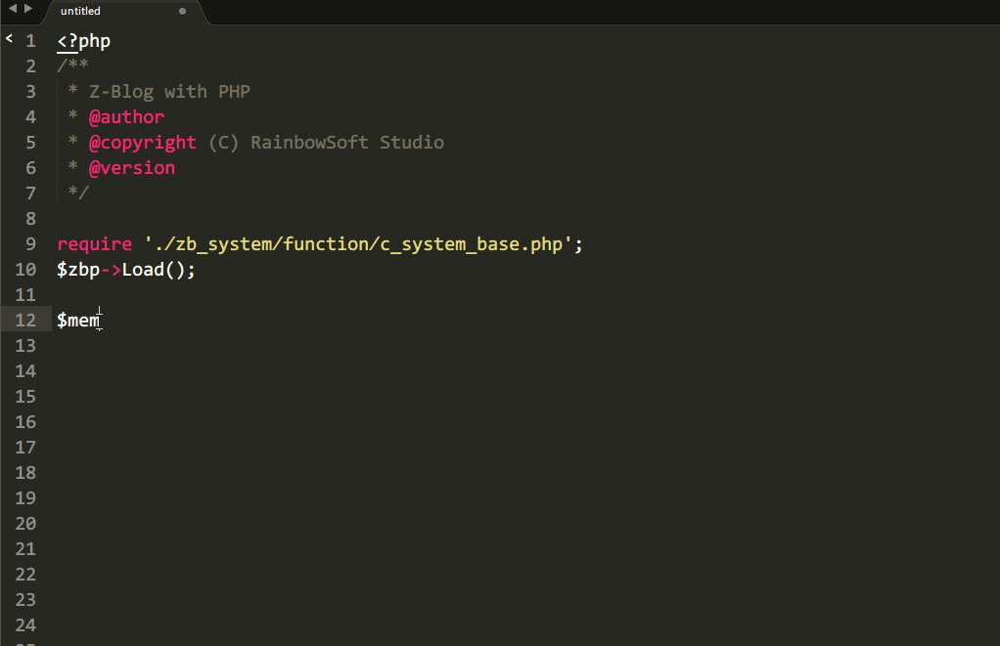

# Z-Blog Snippets
---

Z-Blog 代码提示片段。

## 使用效果

## 下载代码片段
- [Sublime Text](https://github.com/zblogcn/snippets/releases/download/Sublime_V0.1/zblogcn.zip)

##安装说明
- **Sublime Text**：打开 `Preferences > Browse Packages`，在打开的文件夹（一般为`C:\Users\用户名\AppData\Roaming\Sublime Text 3\Packages\Packages`）中解压下载的文件目录（`zblogcn`）。

##代码提示目录
