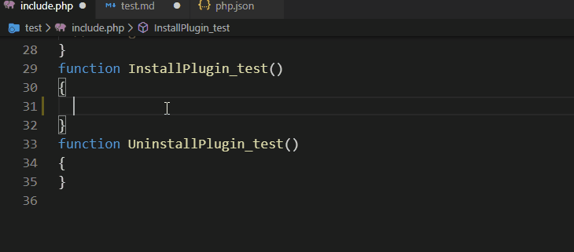

# Z-Blog Snippets

Z-Blog 代码提示片段。

<!--

wdssmq/snippets: Z-Blog 编辑器代码提示片段
https://github.com/wdssmq/snippets

-->

## 使用效果

## 下载代码片段

### Visual Studio Code

[PHP](https://raw.githubusercontent.com/wdssmq/snippets/master/vscode/zblogcn/php.json "PHP代码片段") / [HTML](https://raw.githubusercontent.com/wdssmq/snippets/master/vscode/zblogcn/html.json "HTML代码片段")

-----

### Sublime Text

[Sublime Text](https://github.com/zblogcn/snippets/releases/download/Sublime_V0.1/zblogcn.zip)

## 安装说明

**Visual Studio Code**：

「查看」->「命令面板」->「输入`代码片段`」->「代码片段：配置用户代码片段」->「输入或选择`php`/`html`」->「将本项目对应的 JSON 文本粘贴后保存」

**Sublime Text**：

打开 `Preferences > Browse Packages`，在打开的文件夹（一般为`C:\Users\用户名\AppData\Roaming\Sublime Text 3\Packages\Packages`）中解压下载的文件目录（`zblogcn`）。

